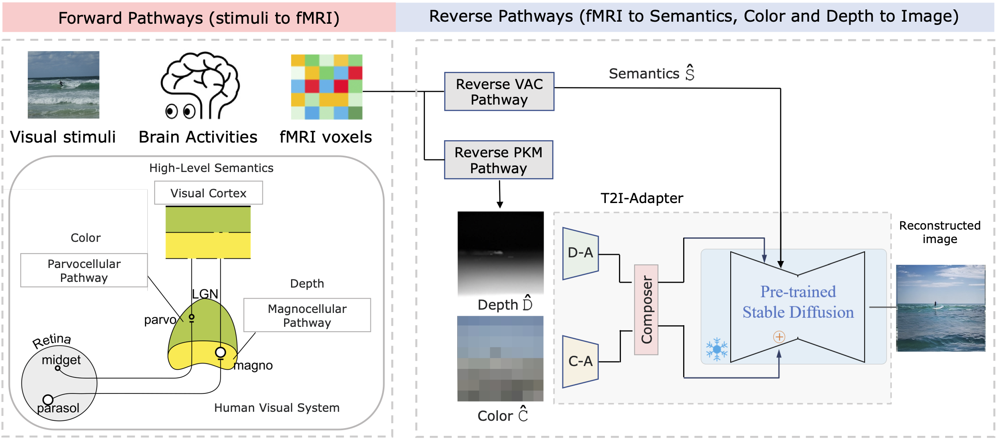

<h2>DREAM: Visual Decoding from Reversing Human Visual System</h2>

    <a href='https://weihaox.github.io/' target='_blank'>Weihao Xia</a>1&emsp;
    <a href='https://team.inria.fr/rits/membres/raoul-de-charette/' target='_blank'>Raoul de Charette</a>2&emsp;
    <a href='https://www.cl.cam.ac.uk/~aco41/' target='_blank'>Cengiz Öztireli</a>3,4&emsp;
    <a href='http://www.homepages.ucl.ac.uk/~ucakjxu/' target='_blank'>Jing-Hao Xue</a>1&emsp;

    1University College London&emsp;
    2Inria&emsp;
    3Google Research&emsp;
    4University of Cambridge&emsp;

---

<h4 align="center">
  <a href="https://weihaox.github.io/projects/DREAM.html" target='_blank'>[Project Page]</a> •
  <a href="" target='_blank'>[arXiv]</a>    
  
</h4>

>**Abstract:** In this work we present DREAM, an fMRI-to-image method for reconstructing viewed images from brain activities, grounded on fundamental knowledge of the human visual system (HVS). We craft reverse pathways that emulate the hierarchical and parallel nature of how humans perceive the visual world. These tailored pathways are specialized to decipher semantics, color, and depth cues from fMRI data, mirroring the forward pathways from visual stimuli to fMRI recordings. To do so, two components mimic the inverse processes within the HVS: the Reverse Visual Association Cortex (R-VAC) which reverses pathways of this brain region, extracting semantics from fMRI data; the Reverse Parallel PKM (R-PKM) component simultaneously predicting color and depth from fMRI. The final images are reconstructed by the Color Adapter (C-A) and the Depth Adapter (D-A) in T2I-Adapter in conjunction with SD from deciphered semantics, color, and depth cues.

<tr>
    
</tr>

The code will be available soon.